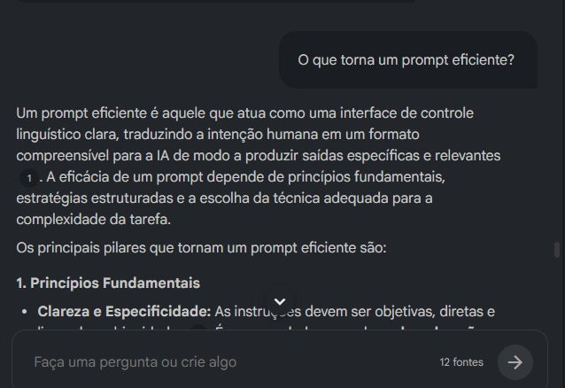

# Fundamentos de IA e NotebookLM

## Sobre o projeto

Este projeto foi desenvolvido durante o bootcamp Python para Análise e Automação de Dados, promovido pela Accenture em parceria com a DIO.

A proposta deste primeiro desafio foi explorar conceitos iniciais de Inteligência Artificial e entender como ferramentas de IA Generativa podem auxiliar no aprendizado, organização de estudos e desenvolvimento de soluções tecnológicas.

Durante essa etapa foram estudados temas como:
- fundamentos da IA moderna;
- Machine Learning;
- LLMs;
- IA Generativa;
- Engenharia de Prompt;
- copilotos de desenvolvimento;
- utilização prática do NotebookLM.

Além do conteúdo técnico, o desafio também teve como objetivo incentivar a aprendizagem ativa utilizando IA como apoio nos estudos.

---

## Objetivos de aprendizagem

- Entender os conceitos básicos de Inteligência Artificial;
- Compreender como funcionam os modelos de linguagem (LLMs);
- Aprender os fundamentos da Engenharia de Prompt;
- Explorar o uso do NotebookLM;
- Utilizar IA como ferramenta de apoio ao aprendizado;
- Desenvolver uma base sólida para os próximos módulos do bootcamp.

---

## Ferramentas utilizadas

- Python
- NotebookLM
- GitHub
- IA Generativa
- Prompt Engineering

---

## Status do projeto

Em desenvolvimento.

---

## Fontes utilizadas

As fontes abaixo foram utilizadas como base de estudo no NotebookLM:

- https://www.promptingguide.ai/pt
- https://docs.python.org/3/
- https://ai.google/

---

## Exploração prática no NotebookLM

Durante o desenvolvimento do projeto, o NotebookLM foi utilizado como ferramenta de apoio aos estudos e organização do conhecimento.

Foram realizados testes com prompts voltados para:
- IA Generativa;
- LLMs;
- Engenharia de Prompt;
- funcionamento da Inteligência Artificial moderna.

Algumas perguntas utilizadas:

### Prompt 1
> Explique de forma simples o que é IA Generativa.

### Prompt 2
> Qual a diferença entre IA tradicional e IA Generativa?

### Prompt 3
> Como os LLMs funcionam?

### Prompt 4
> O que torna um prompt eficiente?

---

## Aprendizados obtidos

Durante os testes foi possível perceber como a forma da pergunta influencia diretamente na qualidade da resposta gerada pela IA.

Também foi possível entender:
- a importância do contexto nos prompts;
- como os LLMs interpretam informações;
- como a IA pode auxiliar no aprendizado técnico;
- a utilidade do NotebookLM na organização dos estudos.

---

## Dificuldades encontradas

No início, algumas respostas ficaram muito amplas e genéricas.

Para melhorar os resultados, foi necessário:
- criar perguntas mais específicas;
- adicionar contexto;
- dividir perguntas complexas em partes menores.

Esse processo ajudou a compreender melhor os fundamentos da Engenharia de Prompt.

---

## Registros do desenvolvimento

### Utilização do NotebookLM

### Testes de prompts

.jpeg)

### Respostas geradas pela IA

.jpeg)

### Exploração prática da ferramenta

.jpeg)
